# Platform Architecture

## Objective

Build a research and execution ecosystem that discovers whether a statistical arbitrage edge exists, identifies the source of that edge, validates it out of sample, and only then routes capital to the highest-ranked opportunities.

## Research Flow

1. Extract all Crypto Wizards endpoints and fields.
2. Archive every raw response for reproducibility.
3. Generate field and formula dictionaries.
4. Convert fields into explainable 0-100 factors.
5. Test each strategy family independently.
6. Run ablation tests to isolate alpha contribution.
7. Split results by regime, pair, liquidity, volatility, and cost bucket.
8. Rank pairs and strategies by cost-adjusted expectancy, profit factor, Sharpe, drawdown, and robustness.
9. Store every trade and feature snapshot for meta-learning.

## LangGraph Agent Workflow

The project orchestration spine is now expressed as a LangGraph workflow. It wraps the existing stage contracts instead of replacing them, so the same research commands still produce the same evidence files while LangGraph owns the run state, stage ordering, and fail-fast/report-only behavior.

The canonical workflow document is `docs/langgraph_agent_workflow.md`. Runtime graph evidence is written to:

- `reports/active/langgraph_agent_lanes.csv`
- `reports/active/langgraph_agent_edges.csv`
- `reports/active/langgraph_agent_workflow_state.json`
- `reports/active/langgraph_agent_workflow.md`

The proposed event-driven extension, including the comparison to the current ordered workflow and the strategy-cell model, is documented in `docs/dynamic_multi_agent_architecture.md`. It remains shadow-mode design work until its evidence and safety behavior is proven against the existing workflow.

## Runtime Setup and Component Graph

The quant platform is a Python package. The locked development environment is
installed with `uv sync --extra dev --locked`, and project commands and tests
should run through `uv run` so they use the versions in `uv.lock`. On this
Mac mini's exFAT Expansion checkout, set `UV_PROJECT_ENVIRONMENT` to an internal
drive path before installation or `uv run`; the default on-drive `.venv` is
incomplete and AppleDouble sidecars can disrupt wheel installation.

Node.js is auxiliary rather than the platform runtime. This repository has no
`package.json` or npm dependency lockfile. The `.js` and `.mjs` helpers are
browser-capture adapters that expect a host-provided `tab.playwright` object;
they are not standalone Playwright programs. The optional TradeStaq MCP entry
uses `npx` and downloads its package on first use. See
`docs/tradestaq_mcp_setup.md` before enabling that integration.

```mermaid
flowchart LR
    A[Crypto Wizards discovery] --> B[Exact setup and timeframe capture]
    H[Public exchange market data] --> C[Immutable raw evidence]
    B --> C
    C --> D[Schema, lineage, freshness, and universe checks]
    D --> E[Point-in-time pair replay]
    E --> F[Two-leg PnL and observed cost stress]
    F --> G[Walk-forward and regime acceptance]
    G -->|research only| J[Watch journal and verified outcomes]
    J --> K[Leakage-audited ML gate]
    K -->|advisory unless accepted| L[Portfolio and venue compatibility]
    L -->|separate approval and evidence| M[Testnet candidate]
    M -->|explicit user authorization| N[Live canary]
    G -->|failed or incomplete| R[Blocked, rejected, or fetch-more evidence]
    N -. disabled by default .-> S[Live trading]
```

The Mermaid flow is the research and authority path. The executable LangGraph
wrapper is a separate control-flow graph that initializes run state, invokes the
selected existing stage contracts in order, routes fail-fast or report-only
results, and finalizes reports. A graph edge describes an allowed handoff; it is
not evidence that the stage ran or passed.

The graph lanes are: project scrub, Crypto Wizards capture, local verification, paper watch journal, execution compatibility, ML gate, base RL handoff, and gap/pre-mortem/red-team review. This keeps Wizard discovery, live journaling, Injective/dYdX execution truth, machine learning labels, and reinforcement learning promotion on one explicit workflow path.

## Unified Experiment Harness

Every strategy is evaluated through one scoreboard. The harness runs strategies by pair, regime, and cost bucket, then writes full results, strategy summaries, regime summaries, and implementation coverage. Strategies without executable signal functions are marked as skipped instead of silently disappearing from research reports.

## Ablation Testing

Ablation reports compare enhanced strategies against simpler baselines on matched pair, regime, and cost-bucket rows. The report quantifies incremental profit factor, Sharpe, expectancy, drawdown improvement, win rate, and trade count so ECM, copula, Hurst, half-life, OU, regime filters, and proprietary components can be rejected when they do not add value.

## Fixture-Based Ingestion

Archived Crypto Wizards JSON and CSV samples live in `data/raw`. Fixture ingestion discovers fields, normalizes common metric aliases into experiment-ready columns, derives copula probability distortion from `u1_given_u2 - u2_given_u1` when needed, and groups rows into pair datasets for the experiment harness. This keeps research reproducible before live API credentials are available.

## Modules

- API Extraction Engine: endpoint discovery, response archiving, field dictionary generation.
- Formula Intelligence Engine: formula, interpretation, use case, and failure mode per field.
- Quant Brain Engine: research role and hypothesis per field.
- Feature Engine: normalized scores from 0-100.
- Strategy Research Lab: independent strategy registry and backtests.
- Copula Research Lab: conditional probability distortion, tail dependency, and copula-only strategies.
- ECM Research Lab: correction speed, leader/follower, and incremental alpha tests.
- Regime Research Lab: HMM, GMM, KMeans, and explicit bull/bear/range/crisis splits.
- Portfolio Engine: rank, allocate, cap exposure, control concentration.
- Meta Learning Engine: learn from every trade feature vector and realized outcome.
- dYdX Execution Engine: dry-run first, dYdX testnet paper trading second, then authenticated live market data/order/fill/funding adapters only after explicit risk gates.

## Priority Readiness Spine

`reports/priority_readiness.csv` tracks P1-P5 gates. P5 is the learning-event store gate: paper handoff records are treated as audit evidence, but the gate is only ready once `data/meta_learning/trades.jsonl` or equivalent learning inputs contain enough realized outcome records to feed outcome prediction, feature importance, and model degradation checks.

`reports/priority_action_plan.csv` is a sorted projection of blocked readiness gates. It keeps the operational queue aligned with the current spine state instead of maintaining a separate checklist that can drift from the actual gates.

`reports/priority_spine_dashboard.csv` condenses P1-P5 into one row per priority area, linking each blocker to its source report and next action.

## dYdX Execution Modes

- Dry run is local-only and never submits orders.
- Paper trading maps to dYdX testnet endpoints for risk-free testing before mainnet.
- Paper order submission is disabled by default until wallet credentials, official dYdX client wiring, and risk controls are explicitly configured.
- Paper spread intents are generated only after the acceptance report marks the strategy production-eligible.
- Authenticated paper submission requires explicit credentials and remains blocked by default.
- Live execution is out of scope until the research system proves edge after fees, funding, slippage, and execution risk.
- Borrow/short cost is tracked for spot or margin research lanes when known, but missing borrow data is not a research-test stopper. It becomes a paper/live execution preflight item only if we choose a spot or margin venue that requires borrowing.

## Two-Leg Spread Accounting

When `price_x` and `price_y` are available, the backtester uses explicit two-leg market-neutral accounting instead of a single spread delta. Leg weights are sized from hedge ratio and beta, then adjusted for taker fees, slippage, execution risk, per-leg funding, and partial-fill assumptions. Execution risk remains inside the net-return calculation, but it is not a standalone research gate stopper. Production acceptance requires the experiment rows to prove the two-leg inputs were present: leg prices, hedge ratio, beta, and both per-leg funding fields.

## Acceptance Gates

The versioned policy in `config/acceptance_policy_manifest.json` defines the
corrective program's five-fold walk-forward, minimum positive folds and trade
count, base/stress costs, `ALL`-regime, false-discovery, independent-cluster,
regime, parameter, and concentration requirements. It also binds source hashes
for `config/research.yaml` and the cost/discovery contracts.

`config/research.yaml` separately specifies higher platform targets, including
100 completed trades, profit factor 1.8, Sharpe 1.2, maximum drawdown 15%, and
at least two pairs. The manifest hash-binds this file, but the project does not
state whether those targets are a second conjunctive gate or how each pipeline
must apply them. Until a new versioned resolver settles that relationship,
require both sets of gates for promotion and fail closed on any disagreement.

Passing research gates only qualifies a candidate for the next separately
authorized stage. The manifest keeps Testnet orders and live trading under
separate gates and sets live trading to unauthorized by default.
