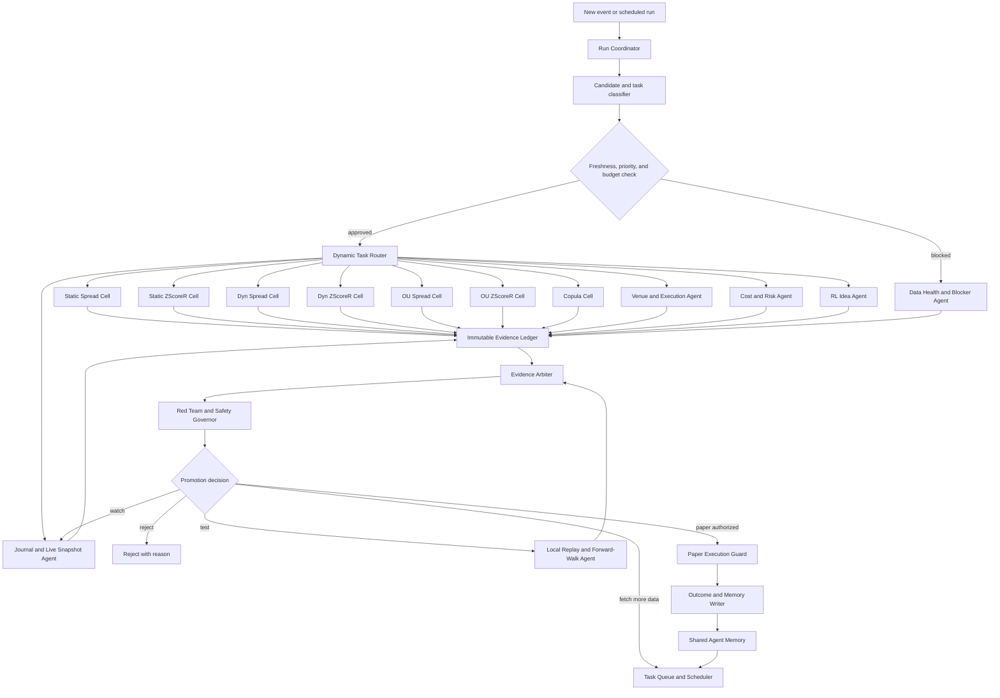
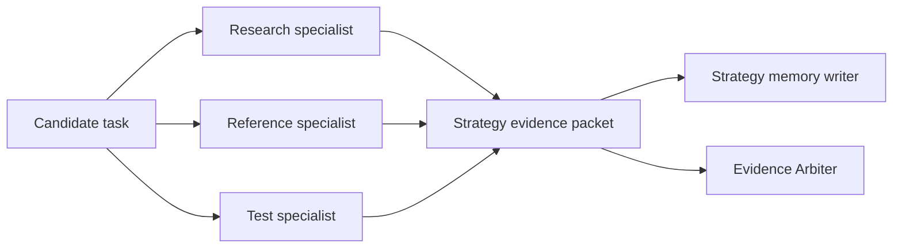
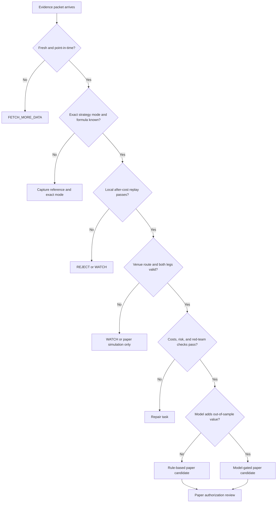

# Dynamic Multi-Agent Architecture

## Purpose

This document proposes a dynamic multi-agent architecture to compare with the current LangGraph workflow. It keeps the existing evidence gates, promotion rules, and audit trails. The change is in how work is selected, delegated, challenged, and returned to the orchestrator.

The design is proposed. It is not the current execution authority until it runs in shadow mode and produces equivalent or better evidence quality than the existing workflow.

## Implemented Shadow Controls

The first implemented cell is `Copula`. It is a report-only comparison with the
existing sequential local replay, not a replacement for it. The control plane
now has versioned candidate, task, evidence, veto, decision, and outcome
contracts; immutable evidence/decision/veto/outcome records; idempotent task
creation; atomic task snapshots; worker leases; retry limits; expiry recovery;
and a venue-policy veto.

The current rollout rule is intentionally narrow:

1. The Copula cell must produce five distinct comparisons with exact
   `TEST`/`TEST` agreement between the sequential and dynamic paths.
2. Every qualifying comparison must be explicitly shadow-only, contain all five
   required evidence packets, and have no safety veto.
3. Any `requires_review` comparison, stale/insufficient evidence, or venue
   veto keeps the rollout blocked.
4. Passing the threshold makes one additional strategy family eligible only for
   an independent shadow trial. It does not permit promotion, paper execution,
   or live execution.

The report at `reports/orchestration/dynamic_agents/strategy_cell_rollout.csv`
is the authority for this expansion decision. It is derived from the append-only
`reports/orchestration/dynamic_agents/copula_comparison_events.jsonl` ledger,
not from a replaceable dashboard CSV. `dynamic_rollout` runs it alone;
`copula_shadow` runs the comparison followed by the rollout gate.

`dynamic_supreme_team` writes a four-lens checkpoint alongside these reports:
gap analysis, pre-mortem, post-mortem, and red-team review. It is an evidence
linked repair plan, not a source of strategy signals or execution authority.

## Isolated Runner

Dynamic controls have their own lightweight entrypoint and do not import the
legacy ML stack:

```bash
PYTHONPATH=src python -m quant_platform.orchestration.dynamic_cli --stage dynamic_rollout
PYTHONPATH=src python -m quant_platform.orchestration.dynamic_cli --stage copula_shadow --pair-id ASSET-USD/ASSET-USD
```

This runner is strictly shadow-only. It reads a current
`reports/active/venue_account_capabilities.csv` record before a venue can pass
research routing. Each row must carry `schema_version=venue_capabilities.v1`,
venue, account eligibility, product type, short-leg support, and a capture
timestamp. A missing, malformed, stale, or unversioned record creates a veto.

## Current Workflow

The current LangGraph runtime has three control nodes:

```mermaid
flowchart LR
    start([Start]) --> initialize[Initialize]
    initialize --> run_stage[Run next ordered stage]
    run_stage --> route{More stages or fail-fast blocker?}
    route -->|continue| run_stage
    route -->|finish| finalize[Finalize reports]
    finalize --> end([End])
```

Its stage list is intentionally ordered. Discovery, verification, journal, venue checks, model work, RL work, Supreme Team review, dashboard build, and paper readiness each produce evidence before the next stage consumes it.

The project also has useful specialist pieces already:

- Eleven mini-agents for discovery, venue evidence, data quality, strategy tests, RL ideas, cost/risk, red team, and decision support.
- Seven strategy specialists: Static Spread, Static ZScoreR, Dyn Spread, Dyn ZScoreR, OU Spread, OU ZScoreR, and Copula.
- Per-agent memory events, a task queue, learning summaries, effectiveness scores, and a specialist scoreboard.

The limitation is that these pieces are mainly represented as registries and reports. The top-level graph runs an ordered list of stages; it does not yet dynamically fan a candidate out to the right specialists, collect their evidence packets, resolve disagreement, and return a single auditable decision.

## Proposed Architecture



This is a controlled network, not a committee that can vote itself into a trade. No specialist can submit an order or promote a candidate alone.

## Control Plane

### Run Coordinator

Owns the run ID, user intent, schedule, pair scope, safety settings, and run budget. It turns events into bounded tasks.

Example events:

- Daily Crypto Wizards scanner refresh.
- A pair moves beyond an absolute z-score threshold.
- A new Copula Arbitrage dashboard row appears.
- A local replay completes or fails.
- Venue liquidity, funding, or data freshness changes.
- A paper trade closes and creates an outcome label.

### Candidate and Task Classifier

Reads the event and chooses the smallest useful set of agents. It does not wake every agent for every event.

Examples:

| Event | Selected work |
| --- | --- |
| Wizard row says `OU (ZScoreR)` | OU ZScoreR cell, reference agent, local replay agent, venue evidence agent |
| Copula conditional-probability gap is active | Copula cell, dashboard snapshot agent, dependency/stationarity checks, cost/risk agent |
| Pair has stale candles | data health only; no strategy or model work |
| RL suggests a similar pair | discovery agent and the matching strategy cells; RL remains idea-only |
| Binance.US spot candidate | venue agent checks spot-only inventory and sellability before any paper route |

### Dynamic Task Router

Creates task cards with a stable task ID, scope, evidence inputs, due time, allowed actions, and required output schema. It uses three controls:

- Priority: safety and stale-data repairs outrank discovery work.
- Freshness: new dashboard evidence can supersede an older task, but the old task remains in the audit trail.
- Budget: a run has limits on API calls, dashboard captures, backtests, and concurrent specialists.

### Evidence Arbiter

Consumes evidence packets, not agent opinions. It checks that every claimed result has a path, timestamp, source, point-in-time status, and defined formula or test configuration.

The arbiter can produce only:

- `REJECT`
- `FETCH_MORE_DATA`
- `WATCH`
- `TEST`

It cannot return paper or live execution authorization. Paper authorization,
if ever added outside this shadow controller, must be a separately audited
execution-governance decision.

### Red Team and Safety Governor

Has veto authority. It tests for leakage, dashboard hindsight, stale data, thin trade counts, cost mismatch, concentration, venue mismatch, and unavailable sell/short mechanics.

Every veto must include a blocker code, evidence path, and repair task. It may block a candidate but cannot promote one.

## Strategy Cells

Each strategy family becomes a cell with four tightly scoped specialists. These specialists share a strategy memory, but their outputs remain separate.



| Strategy cell | Research specialist looks for | Reference specialist protects | Test specialist verifies |
| --- | --- | --- | --- |
| Static Spread | fixed-hedge spread dislocations | spread formula and hedge definition | after-cost mean reversion with fixed hedge |
| Static ZScoreR | normalized fixed-hedge extremes | z-score lookback and threshold | entry/exit behavior at the exact normalizer |
| Dyn Spread | rolling-hedge spread dislocations | rolling beta/hedge formula | beta stability and recalculation effects |
| Dyn ZScoreR | dynamic normalized extremes | dynamic z-score window | no hidden future beta or normalizer leakage |
| OU Spread | pullbacks consistent with OU behavior | OU calibration and half-life meaning | half-life stability and exit timing |
| OU ZScoreR | normalized OU deviations | OU z-score computation | OU parameter stability across folds |
| Copula | asymmetric conditional dislocation | copula family, conditional probability, point-in-time fields | dependency, stationarity, tail-risk, and local replay |

Each cell produces an `evidence_packet`, never a trade command. Required fields:

```text
candidate_id
strategy_family
pair
timeframe
event_timestamp
source_timestamp
point_in_time_status
formula_version
test_configuration_hash
finding
confidence_band
blockers
evidence_paths
next_task
```

## Horizontal Agents

These agents work across all strategy cells.

| Agent | Role | Authority |
| --- | --- | --- |
| Discovery Agent | Finds candidates from Wizards, APIs, and venue sweeps | hypothesis only |
| Data Health Agent | Checks histories, freshness, missing data, and symbol mapping | can block |
| Venue Agent | Confirms market availability, spot/perp type, contracts, borrow or inventory rules, liquidity, and route suitability | can block |
| Cost and Risk Agent | Models fee, spread, slippage, funding, borrow, and drawdown risk | can block |
| Journal Agent | Captures point-in-time dashboard, entry, exit, spread, regime, and outcome snapshots | evidence only |
| Local Replay Agent | Runs exact-mode and forward-walk verification | acceptance evidence only |
| ML Gate Agent | Audits leakage and measures incremental out-of-sample improvement | advisory or blocking |
| RL Idea Agent | Proposes policy variants, exits, sizing ideas, and similar pairs | idea only |
| Red Team Agent | Challenges hidden assumptions and concentration | veto only |
| Supreme Team Agent | Produces gap, pre-mortem, post-mortem, and red-team checkpoint | repair planning only |

## Shared State and Memory

The architecture separates recordkeeping from learning.

| Store | Purpose | Rule |
| --- | --- | --- |
| Evidence Ledger | Immutable source captures, test configurations, and outputs | required for every material decision |
| Candidate Ledger | Current pair/setup state and decision bucket | one canonical row per candidate/setup identity |
| Task Queue | Work requests, priorities, dependencies, and retry policies | tasks expire when inputs become stale |
| Strategy Memory | What each of the seven strategy cells learned | can guide research, never override gates |
| Agent Memory | Agent effectiveness and recurring failure patterns | outcome-based, versioned, and auditable |
| Outcome Ledger | Separate backtest, paper, and live outcomes | labels cannot be mixed |
| Decision Ledger | Arbiter decision, votes, vetoes, reasons, and next tasks | append-only |

Memory must record both wins and failures. An agent that repeatedly suggests thin or non-tradable candidates should lose routing priority, not gain authority.

## Decision Protocol



Important U.S. venue rule:

```text
Binance.US spot evidence can support research and inventory-based spot routing.
It cannot authorize a synthetic short leg unless sell inventory or a verified,
allowed borrow/margin mechanism exists for that exact account and symbol.
```

## Current Versus Proposed

| Dimension | Current workflow | Proposed dynamic architecture |
| --- | --- | --- |
| Control flow | ordered stage list | event-driven bounded task graph |
| Agent selection | stages largely run as a group | router selects only relevant specialists |
| Strategy specialization | seven scorecard specialists | seven active cells with research/reference/test/memory roles |
| Communication | CSV reports and stage results | versioned evidence packets plus ledgers |
| Disagreement | surfaced in reports | arbiter plus red-team veto and repair task |
| Memory | agent event summaries and effectiveness | scoped strategy, agent, candidate, and outcome memories |
| Scheduling | manual or stage-group run | freshness, priority, budget, and dependency-aware scheduling |
| Safety | stage blockers and paper-readiness gate | same gates plus explicit veto, expiry, and venue-policy checks |
| Adoption risk | already working and auditable | must shadow-run before becoming authoritative |

## Migration Plan

1. Define `evidence_packet`, `task_card`, `decision_record`, and `veto_record` schemas.
2. Write adapters that turn current Wizard captures, local replays, venue reports, and journal rows into evidence packets.
3. Add the dynamic router in report-only shadow mode. It may schedule and compare tasks but cannot change promotion decisions.
4. Activate the seven strategy cells one at a time, beginning with Copula and the exact modes that have the strongest current evidence coverage.
5. Add the arbiter and red-team veto ledger. Compare its decisions against the current sequential workflow for a fixed evaluation period.
6. Promote the router from shadow mode only when it has no missing lineage, no safety regressions, and demonstrably reduces wasted tests or stale work.
7. Keep the existing LangGraph spine as the final safety shell. The dynamic graph should plug into it, not replace it all at once.

## Non-Negotiable Guardrails

- No single agent may promote a pair, strategy, or trade.
- Crypto Wizards remains discovery and confirmation evidence, not promotion authority.
- No dashboard hindsight field may become a live feature without a point-in-time audit.
- Local after-cost replay and forward-walk evidence remain acceptance authority.
- RL and agent memory can prioritize research but cannot override the arbiter or safety governor.
- A stale, missing, or unmapped field creates a blocker, never a silent zero.
- Backtest, paper, and live labels remain separate.
- All venue decisions must respect account eligibility and exact product mechanics.
