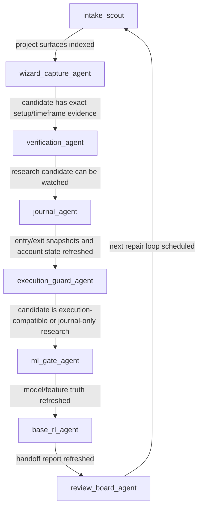

# LangGraph Agent Workflow

This project now has a first-class LangGraph workflow around the research, journal, execution, ML, RL, and review lanes. The graph does not replace the existing research engines. It coordinates them as agents with explicit evidence and promotion rules.

## Why This Exists

The project has grown into a full evidence-gated trading research system:

```text
Crypto Wizards capture
-> exact setup and timeframe evidence
-> local verification
-> journal/watch entries
-> execution compatibility
-> machine learning gate
-> base RL handoff
-> gap / pre-mortem / red-team review
```
The LangGraph layer makes that process explicit and repeatable. It also keeps the top-level answer from outrunning the underlying evidence.

## Run It

Dry-run the full workflow without executing expensive or live stages:

```bash
PYTHONPATH=src ./.venv311/bin/python -m quant_platform.cli run-langgraph-agent-workflow --stage all --dry-run
```

Run one lane as a dry-run:

```bash
PYTHONPATH=src ./.venv311/bin/python -m quant_platform.cli run-langgraph-agent-workflow --stage discovery --dry-run
```

Run report-only review stages:

```bash
PYTHONPATH=src ./.venv311/bin/python -m quant_platform.cli run-langgraph-agent-workflow --stage supreme_team --report-only
```

## Generated Reports

The workflow writes:

- `reports/active/orchestrator_run_status.csv`
- `reports/active/orchestrator_run_status.md`
- `reports/active/orchestrator_events.jsonl`
- `reports/active/langgraph_agent_lanes.csv`
- `reports/active/langgraph_agent_edges.csv`
- `reports/active/langgraph_agent_workflow_state.json`
- `reports/active/langgraph_agent_workflow.md`

## Agent Lanes

| Agent | Lane | Owns | Promotion Rule |
| --- | --- | --- | --- |
| `intake_scout` | project scrub | artifact index, current state, docs/report inventory | no promotion; discovery only |
| `wizard_capture_agent` | Crypto Wizards capture | scanner capture, pair-detail capture, exact setup identity, timeframe matrix | Wizard evidence creates hypotheses only |
| `verification_agent` | local verification | exact-mode replay, after-cost tests, pair universe, blockers | requires local after-cost and forward-walk support |
| `journal_agent` | paper watch journal | entry/exit snapshots, live monitor refresh, outcome labels | closed outcomes need verified exits before ML/RL labels |
| `execution_guard_agent` | execution compatibility | dYdX compatibility, account-state blocker, Injective spot-first lane | paper submits only through confirmed markets |
| `ml_gate_agent` | machine learning gate | trade dataset, leakage audit, walk-forward model, gated backtest | model must improve out-of-sample edge |
| `base_rl_agent` | reinforcement learning | route candidates, pair coverage, feedback, paper handoff | paper-authorized only when all gates pass |
| `review_board_agent` | gap/pre/red review | gap analysis, pre-mortem, postmortem, red-team, supreme-team | current-state blockers are formal review gaps |

## Guardrails

- Wizard scanner rows are discovery evidence, not trade authorization.
- Page-two Wizard captures must keep exact strategy, timeframe, lookback, z-score/spread source, and visible dashboard numbers.
- Journal entries must include entry and exit snapshots, including prices where available.
- dYdX or Injective routing cannot be treated as real paper execution unless both legs are confirmed on the target venue.
- `broadcast_accepted_unconfirmed` is audit evidence only, not learning-ready outcome evidence.
- ML and RL can learn from Wizard outcomes, but Native promotion remains independent.
- Red-team and pre-mortem checks include current-state blockers, so green review output cannot hide execution reality.

## Current Project Fit

The graph wraps the existing stage contracts in `quant_platform.orchestration.nodes`. That means the project can keep using the established CLI commands and reports, while LangGraph provides the workflow spine:


